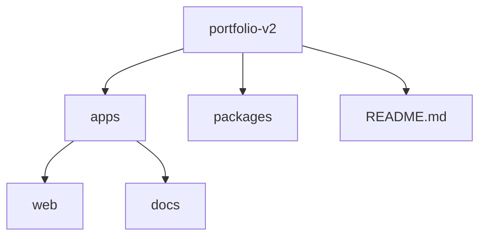

# 🚀 Portfolio Platform v2 -> Portfolio CMS

A modern, data-driven **developer portfolio platform** built with a focus on **scalable systems, clean architecture, and real-world engineering practices**.

This project is more than a personal website — it is a **full-stack platform** that integrates live data, documentation, and system design thinking into a single developer experience.


## 🌐 Live

- 🧠 Documentation: https://erzan-docs.vercel.app  
- 💻 Portfolio App: https://erzan-dev.vercel.app/

## 📖 Overview

Portfolio Platform v2 is designed to showcase:

- Real-world projects
- System design thinking
- Engineering decisions
- Continuous development activity

It integrates live repository data and structured documentation to create a **dynamic and evolving portfolio**.

## ✨ Features

### 🧠 System Design Showcase
- Architecture-focused project presentations
- Engineering decision documentation
- Scalable system thinking

### 📦 Dynamic Project Platform
- GitHub repository integration
- Real-time project insights:
  - Stars ⭐
  - Forks 🍴
  - Last updated timestamp
- Auto-synced project data

### 🎴 Reusable UI System
- Card-based architecture
- Consistent design across:
  - Projects
  - System Design
  - About sections
- Bento-style layouts

### 🖱️ Interactive Experience
- Animated project carousel
- Hover-based animation control
- Smooth motion transitions
- Staggered animations

### 📬 Contact & About
- Bento-style contact section
- Developer story and philosophy
- Current focus and learning

### 📚 Documentation Platform
- Structured engineering documentation
- Visual demos (GIF-based)
- Guides, architecture, and case studies

## 🏗️ Architecture

This project follows a **monorepo structure**:



## ⚙️ Tech Stack

### Frontend
- Next.js 15
- React
- Tailwind CSS
- shadcn/ui
- Framer Motion

### Backend / Data Layer
- GitHub API integration
- Serverless API routes

### Documentation
- Docusaurus

### Deployment
- Vercel

## 🔌 GitHub Integration

The platform uses GitHub as a **single source of truth** for project data.

Features include:

- Fetching repositories dynamically
- Sorting by latest update
- Displaying repository metadata
- Linking directly to source code

## 🎯 Philosophy

This project is built with the following principles:

- **Documentation First**
- **Scalable Architecture**
- **Reusable Systems**
- **Automation Over Manual Work**
- **Clean and Maintainable Code**

## 🛠️ Getting Started

### 1. Clone the repository

git clone https://github.com/Erzan12/portfolio-v2.git
cd portfolio-v2

### 2. Install dependencies
npm install

### 3. Run the apps
## Web App
- cd apps/web
- npm run dev
## Docs
- cd apps/docs
- npm run start

## 🔐 Environment Variables

Create a .env.local file in apps/web:
GITHUB_TOKEN=your_github_token_here

### 🚀 Roadmap

## Completed
- Documentation platform
- System design section
- Interactive UI system
- GitHub integration
- Project showcase
- Contact and About sections

## Upcoming
Advanced project detail pages
Developer activity tracking
Blog / devlog system
Platform analytics
Assitant Chatbot
CMS
Supabase
Schedule call
More quality of life changes UI/UX and content

### 📦 Releases
v0.7.0 – Documentation & UI Interaction Update
v0.8.0 – Dynamic Projects & GitHub Integration
v1.0.0 – Public Portfolio Platform Release 🎉

### 📄 License

- This project is open-source and available under the MIT License.

### 👤 Author

Erzan
- GitHub: https://github.com/Erzan12
- Portfolio: https://erzan-dev.vercel.app/

```bash
