import Tabs from '@theme/Tabs';
import TabItem from '@theme/TabItem';

A practical reference for understanding what Laravel/PHP code is actually doing — not just memorizing syntax.

:::info Mermaid diagrams
This page uses [Mermaid](https://docusaurus.io/docs/markdown-features/diagrams) diagrams. If your Docusaurus site doesn't have it enabled yet, add `@docusaurus/theme-mermaid` and set `markdown: { mermaid: true }` plus the `themes` entry in `docusaurus.config.js`.
:::

## 1. The Big Picture: How Laravel Pieces Fit Together

A useful mental model for a typical Laravel web application:

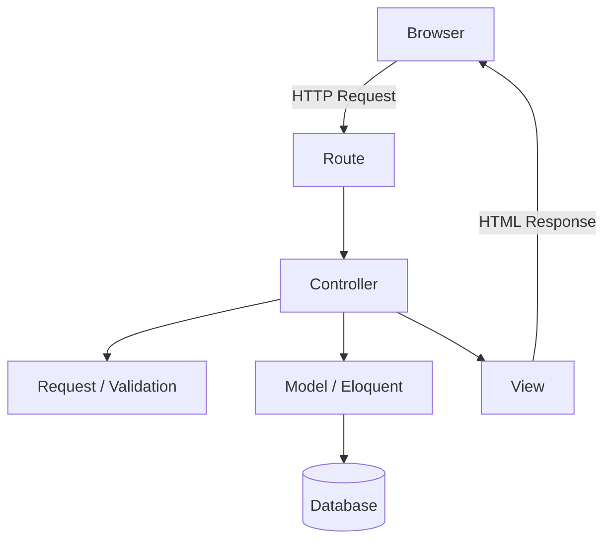

For example:

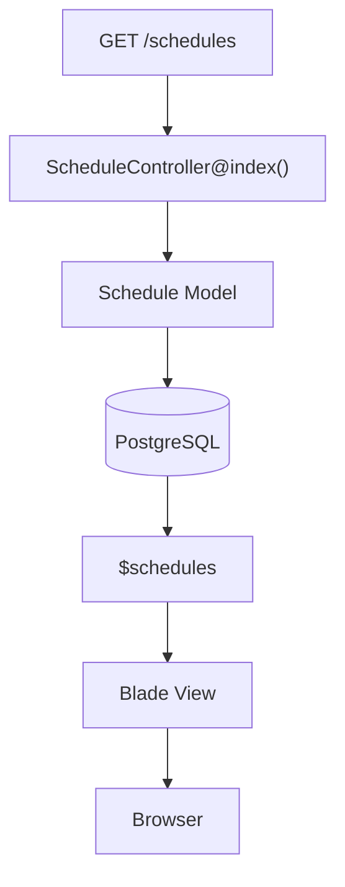

The three most important concepts:

| Part | Main responsibility |
|---|---|
| **Model** | Represents/manages application data and database relationships |
| **Controller** | Handles application logic for an incoming request |
| **View** | Displays information to the user |

This is commonly referred to as the **MVC** pattern: Model → View → Controller.

## 2. Laravel Models

A typical Laravel model looks like:

```php
<?php

namespace App\Models;

use Illuminate\Database\Eloquent\Model;

class Schedule extends Model
{
    protected $fillable = [
        'service_id',
        'specialist_id',
        'time_start',
        'time_end',
        'date',
        'flag'
    ];
}
```

A model usually represents a database table:

| Model | Database table |
|---|---|
| `Schedule` | `schedules` |
| `Service` | `services` |
| `Specialist` | `specialists` |
| `Appointment` | `appointments` |

Laravel's Eloquent ORM lets you interact with database records using PHP rather than writing SQL manually for every operation. For example:

```php
$schedule = Schedule::find(1);
```

is conceptually similar to:

```sql
SELECT *
FROM schedules
WHERE id = 1;
```

## 3. What Is Eloquent?

Eloquent is Laravel's **ORM** (Object-Relational Mapper). ORM means Laravel maps:

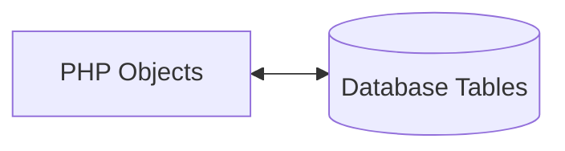

```php
$schedule = Schedule::find(1);
```

returns a `Schedule` model object. You can then access its properties:

```php
$schedule->date;
$schedule->time_start;
$schedule->time_end;
```

Or modify it:

```php
$schedule->flag = 1;
$schedule->save();

// or

$schedule->update([
    'flag' => 1
]);
```

## 4. `protected $fillable`

Consider:

```php
protected $fillable = [
    'service_id',
    'specialist_id',
    'time_start',
    'time_end',
    'date',
    'flag'
];
```

There are two concepts here: `protected` and `$fillable`.

### 4.1 What does `protected` mean?

`protected` is a PHP visibility modifier. PHP commonly has:

<Tabs>
<TabItem value="public" label="public">

Accessible from outside the class.

```php
public $name;
```

</TabItem>
<TabItem value="protected" label="protected" default>

Accessible inside the class and classes that inherit from it.

```php
protected $fillable;
```

</TabItem>
<TabItem value="private" label="private">

Accessible only inside the class where it is defined.

```php
private $secret;
```

</TabItem>
</Tabs>

For `$fillable`, Laravel does not need the property to be `public` — it's an internal configuration property of the model.

## 5. What Is `$fillable`?

`$fillable` defines which attributes are allowed when using **mass assignment**. For example:

```php
Schedule::create([
    'service_id' => 3,
    'specialist_id' => 10,
    'time_start' => '08:00',
    'time_end' => '09:00',
    'date' => '2026-09-05',
]);
```

This is called mass assignment because multiple model attributes are assigned at once. The model says:

```php
protected $fillable = [
    'service_id',
    'specialist_id',
    'time_start',
    'time_end',
    'date',
    'flag'
];
```

Therefore, these attributes are allowed to be mass-assigned. Think of `$fillable` as an allowlist:

| Field | Mass-assignable? |
|---|---|
| `service_id` | ✅ allowed |
| `specialist_id` | ✅ allowed |
| `time_start` | ✅ allowed |
| `time_end` | ✅ allowed |
| `date` | ✅ allowed |
| `flag` | ✅ allowed |
| `some_secret_field` | ❌ not allowed |

### 5.1 Why does `$fillable` exist?

It helps protect against unwanted mass assignment. Imagine a database contains:

```
id
name
email
password
is_admin
```

If an application blindly accepted every submitted field, a malicious user might attempt to submit `is_admin = 1`.

:::caution Security
You generally don't want arbitrary request data to modify sensitive fields. `$fillable` lets you explicitly define which fields can be mass-assigned.
:::

## 6. `$fillable` vs `$guarded`

Laravel also has:

```php
protected $guarded = [];
```

- `$fillable` is an **allowlist**.
- `$guarded` is a **blocklist**.

<Tabs>
<TabItem value="fillable" label="$fillable" default>

```php
protected $fillable = [
    'name',
    'email'
];
```

Means: **only** these fields can be mass-assigned.

</TabItem>
<TabItem value="guarded" label="$guarded">

```php
protected $guarded = [
    'is_admin'
];
```

Means: **everything** can be mass-assigned **except** `is_admin`.

</TabItem>
</Tabs>

For learning and security-conscious development, `$fillable` is often easier to reason about because you explicitly identify what should be writable.

## 7. `use HasFactory;`

At the top of a model you may see:

```php
use Illuminate\Database\Eloquent\Factories\HasFactory;
```

and inside the class:

```php
use HasFactory;
```

These are related but serve different purposes:

- `use Illuminate\Database\Eloquent\Factories\HasFactory;` **imports** the `HasFactory` trait.
- `use HasFactory;` (inside the class) **applies** that trait to the `Schedule` class.

## 8. What Is a PHP Trait?

A trait is a reusable collection of methods and functionality that can be included in multiple classes, instead of duplicating the same functionality across classes:

```php
class Schedule extends Model
{
    use HasFactory;
}
```

Laravel's `HasFactory` trait provides functionality for working with model factories:

```php
Schedule::factory()->create();

// or

Schedule::factory()->count(100)->create();
```

This is especially useful for testing, development, seed data, and generating fake records. If you're not using factories yet, you might not notice the effect of `HasFactory`.

## 9. What Are These Methods in the Model?

Consider:

```php
public function service()
{
    return $this->belongsTo(Service::class);
}
```

This is a normal PHP method that Laravel/Eloquent uses to define a relationship. It is **not** an API, and it's not technically a "helper" — it's a method with a special purpose because it returns an Eloquent relationship.

## 10. `belongsTo()`

Suppose the database looks like:

<Tabs>
<TabItem value="services" label="services" default>

```
id
name
description
```

</TabItem>
<TabItem value="schedules" label="schedules">

```
id
service_id
specialist_id
time_start
time_end
date
flag
```

</TabItem>
</Tabs>

The relationship is `schedules.service_id → services.id`. A schedule belongs to one service:

```php
public function service()
{
    return $this->belongsTo(Service::class);
}
```

means **a Schedule belongs to a Service**. You can then do:

```php
$schedule->service
```

and Laravel can retrieve the related service.

## 11. Laravel's Relationship Naming Conventions

When you write:

```php
return $this->belongsTo(Service::class);
```

Laravel follows naming conventions. Because the related model is `Service`, Laravel expects the foreign key to normally be `service_id`, and the related primary key to normally be `id`. So:

```php
return $this->belongsTo(Service::class);
```

is normally equivalent to:

```php
return $this->belongsTo(
    Service::class,
    'service_id',
    'id'
);
```

That's why the shorter version works.

## 12. Explicit Relationship Keys

You can explicitly provide the keys:

```php
public function specialist()
{
    return $this->belongsTo(
        Specialist::class,
        'specialist_id',
        'id'
    );
}
```

| Parameter | Meaning |
|---|---|
| `Specialist::class` | Related model |
| `'specialist_id'` | Foreign key on `schedules` |
| `'id'` | Primary/owner key on `specialists` |

If your database follows Laravel conventions, you can usually shorten it to:

```php
public function specialist()
{
    return $this->belongsTo(Specialist::class);
}
```

## 13. `hasMany()`

Now consider:

```php
public function appointments()
{
    return $this->hasMany(Appointment::class);
}
```

This means **a Schedule has many Appointments**. The database relationship is `schedules.id → appointments.schedule_id`. For example:

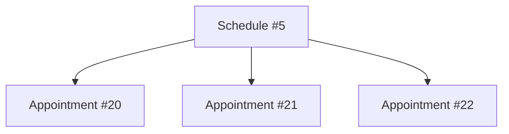

You can access them with `$schedule->appointments`.

## 14. `belongsTo()` vs `hasMany()`

This is a very important distinction.

**Schedule belongs to Service** — many schedules can belong to one service:

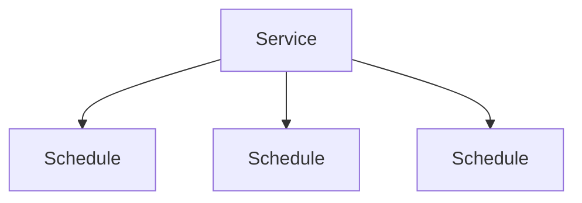

```php
public function service()
{
    return $this->belongsTo(Service::class);
}
```

**Schedule has many Appointments:**

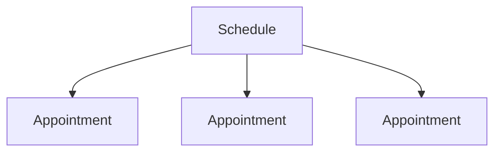

```php
public function appointments()
{
    return $this->hasMany(Appointment::class);
}
```

## 15. `hasOne()` vs `hasMany()`

If one schedule can have exactly **one** appointment:

```php
public function appointment()
{
    return $this->hasOne(Appointment::class);
}
```

If one schedule can have **multiple** appointments:

```php
public function appointments()
{
    return $this->hasMany(Appointment::class);
}
```

The database design determines which relationship is correct — one schedule → one appointment uses `hasOne()`; one schedule → many appointments uses `hasMany()`.

## 16. Important: Relationship Method Names

You can name the method `service()` because one schedule belongs to one service, so `$schedule->service` makes sense. For multiple appointments, `appointments()` and `$schedule->appointments` makes sense. The method name is your application's convenient way of describing the relationship.

## 17. A Small Typo to Watch For

```php
// ❌ Incorrect
return $this->belognsTo(Service::class);

// ✅ Correct
return $this->belongsTo(Service::class);
```

## 18. Controllers

A typical controller:

```php
<?php

namespace App\Http\Controllers;

use App\Models\Schedule;
use App\Models\Service;
use Carbon\Carbon;
use Illuminate\Http\Request;
use Illuminate\Support\Facades\Validator;

class ScheduleController extends Controller
{
    // methods...
}
```

A controller is responsible for handling application actions associated with incoming requests:

| HTTP request | Controller method |
|---|---|
| `GET /schedules` | `ScheduleController@index()` |
| `GET /schedules/create` | `ScheduleController@create()` |
| `POST /schedules` | `ScheduleController@store()` |
| `GET /schedules/5/edit` | `ScheduleController@edit()` |
| `PUT /schedules/5` | `ScheduleController@update()` |
| `DELETE /schedules/5` | `ScheduleController@destroy()` |

## 19. Controller Methods Are Just PHP Methods

```php
public function index(Request $request)
{
    // ...
}
```

is a regular PHP method. Laravel calls it because your route points to it. The word `index` itself does not magically make it an API — you could technically create `public function banana() {}` and Laravel could call it if a route were configured to point to it. The name `index` is simply a widely used Laravel convention.

## 20. Resource Controller Convention

Laravel commonly uses these controller methods, which correspond closely to CRUD (Create, Read, Update, Delete):

| Method | Purpose |
|---|---|
| `index()` | Display a list |
| `create()` | Display a form for creating |
| `store()` | Save a new record |
| `show()` | Display one record |
| `edit()` | Display an edit form |
| `update()` | Update an existing record |
| `destroy()` | Delete a record |

## 21. Is `index()` an API?

Not necessarily. Your method:

```php
public function index(Request $request)
{
    // ...

    return view(
        'specialists.schedules.index',
        compact('schedules')
    );
}
```

is returning a Blade view — a normal server-rendered web request:

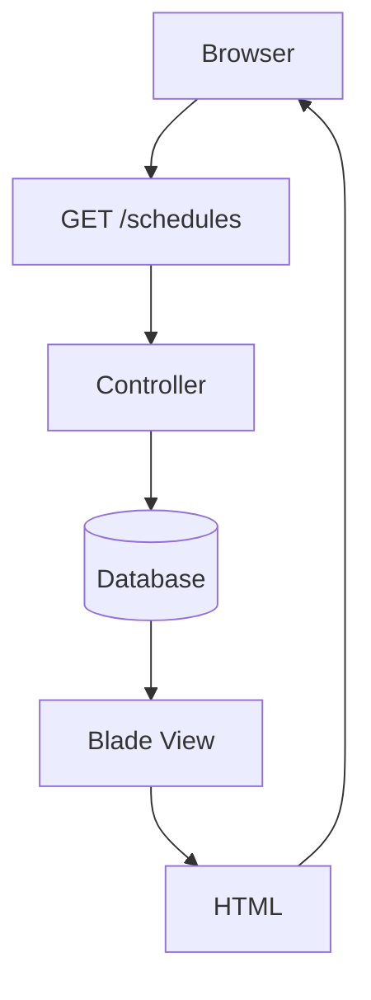

## 22. What Would an API Look Like?

An API endpoint might return JSON instead:

```php
public function index()
{
    $schedules = Schedule::all();

    return response()->json($schedules);
}
```

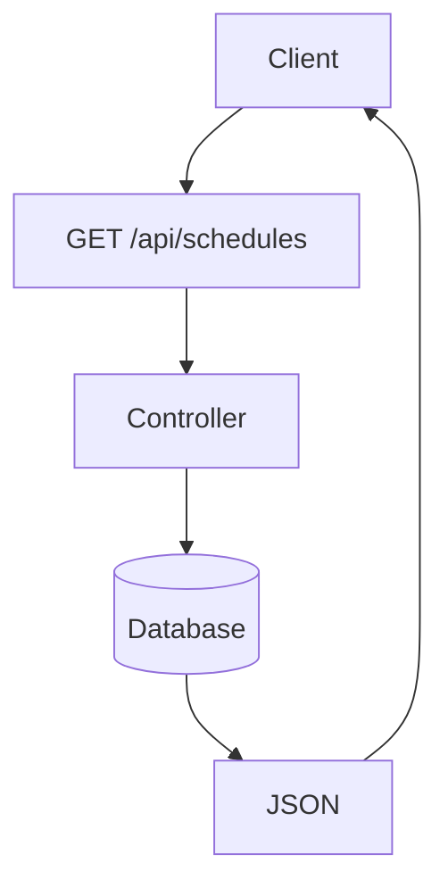

| Response type | Code |
|---|---|
| Blade / web response | `return view(...);` |
| JSON / API response | `return response()->json(...);` |

:::tip
A controller method itself is not automatically an API — the **route** and the **response** determine how it is being used.
:::

## 23. Understanding Your `index()` Method

```php
public function index(Request $request)
{
    $schedules = Schedule::join(
        'services',
        'services.id',
        '=',
        'schedules.service_id'
    )
    ->select([
        'schedules.id',
        'service_id',
        'specialist_id',
        'time_start',
        'time_end',
        'date',
        'flag',
        'schedules.created_at',
        'schedules.updated_at',
        'image',
        'name',
        'description'
    ])
    ->where(
        'specialist_id',
        auth()->user()->user_id
    )
    ->where('flag', 0);

    if ($request->has('keyword')) {
        $schedules = $schedules
            ->where('name', 'LIKE', "%$request->keyword%")
            ->orWhere('description', 'LIKE', "%$request->keyword%")
            ->orWhere('time_start', $request->keyword)
            ->orWhere('time_end', $request->keyword)
            ->orWhere('date', $request->keyword);
    }

    $schedules = $schedules
        ->latest('schedules.created_at')
        ->get();

    return view(
        'specialists.schedules.index',
        compact('schedules')
    );
}
```

This can be understood in stages.

### 23.1 Start the query

```php
$schedules = Schedule::join(...);
```

Laravel starts building a database query involving the `schedules` table.

### 23.2 Join the `services` table

```php
->join(
    'services',
    'services.id',
    '=',
    'schedules.service_id'
)
```

Conceptually:

```sql
JOIN services
ON services.id = schedules.service_id
```

This lets you retrieve service information together with schedule information.

### 23.3 Select columns

```php
->select([
    'schedules.id',
    'service_id',
    'specialist_id',
    ...
]);
```

This tells Laravel which columns to retrieve.

### 23.4 Filter by specialist

```php
->where(
    'specialist_id',
    auth()->user()->user_id
)
```

Only retrieve schedules belonging to the currently authenticated specialist.

### 23.5 Filter active schedules

```php
->where('flag', 0);
```

This adds another condition, conceptually:

```sql
WHERE specialist_id = ?
AND flag = 0
```

### 23.6 Check for a search keyword

```php
if ($request->has('keyword')) {
```

This checks whether the incoming request contains `keyword`. For example, `/schedules?keyword=nurse` means `$request->keyword` would contain `nurse`.

### 23.7 Execute the query

```php
->get();
```

Before `get()`, you're generally **building** the query. When you call `get()`, Laravel **executes** it and retrieves the results:

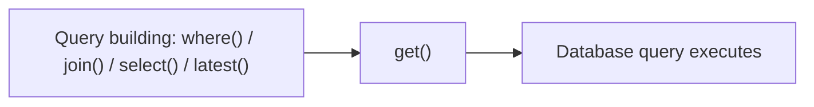

## 24. `return view()`

```php
return view(
    'specialists.schedules.index',
    compact('schedules')
);
```

Laravel looks for a Blade view corresponding to `resources/views/specialists/schedules/index.blade.php`. The `schedules` variable is passed to the view.

## 25. What Is `compact('schedules')`?

This is a native PHP function. If you have `$schedules = [...];`, then `compact('schedules');` creates an associative array approximately equivalent to:

```php
[
    'schedules' => $schedules
]
```

So:

```php
return view(
    'specialists.schedules.index',
    compact('schedules')
);
```

is essentially:

```php
return view(
    'specialists.schedules.index',
    [
        'schedules' => $schedules
    ]
);
```

## 26. What Is `Request`?

At the top:

```php
use Illuminate\Http\Request;
```

This imports Laravel's HTTP request class. Then:

```php
public function index(Request $request)
```

asks Laravel to give the method the current HTTP request, which can contain the URL, query parameters, form data, JSON data, headers, cookies, files, HTTP method, etc.

For example, `GET /schedules?keyword=nurse` — then `$request->keyword` can retrieve `nurse`. You can also use `$request->has('keyword');` to check whether it exists.

## 27. What Is `Validator`?

```php
use Illuminate\Support\Facades\Validator;
```

```php
$validator = Validator::make(
    $request->all(),
    [
        'service_id' => 'required|exists:services,id',
        'time_start' => 'required',
        'time_end' => 'required',
        'date' => 'required'
    ]
);
```

This validates incoming data — for example, `service_id` must be provided and must exist in `services.id`; `time_start`, `time_end`, and `date` must be provided. Then:

```php
if ($validator->fails()) {
```

checks whether validation failed.

## 28. What Is a Facade?

```php
use Illuminate\Support\Facades\Validator;
```

`Validator` here is a Laravel **facade**. Facades provide a convenient, static-looking interface to services managed by Laravel's service container. For example, `Validator::make(...)` looks like you're directly calling a static method, but Laravel handles the underlying service for you.

Other familiar Laravel facades: `DB::`, `Cache::`, `Log::`, `Auth::`, `Storage::`, `Validator::`.

## 29. What Is `Illuminate`?

You will see this everywhere in Laravel: `Illuminate\...`. **Illuminate** is the namespace used by Laravel's framework components. Examples:

```
Illuminate\Http\Request
Illuminate\Database\Eloquent\Model
Illuminate\Support\Facades\Validator
Illuminate\Database\Eloquent\Factories\HasFactory
```

Laravel's framework code lives primarily under the `Illuminate` namespace.

## 30. What Does `use` Mean in PHP?

```php
use App\Models\Schedule;
```

This is an import. It allows you to write `Schedule::find(1);` instead of `\App\Models\Schedule::find(1);`. Similarly, `use Carbon\Carbon;` allows `Carbon::parse($request->date);` instead of `\Carbon\Carbon::parse($request->date);`.

## 31. `namespace`

At the beginning of your controller:

```php
namespace App\Http\Controllers;
```

This defines the PHP namespace of the class. Your controller is typically located at `app/Http/Controllers/ScheduleController.php` and has `namespace App\Http\Controllers;`, so the fully qualified class name is `App\Http\Controllers\ScheduleController`.

## 32. Is a Namespace the Same as a File Path?

Not exactly, though they often correspond in Laravel because Laravel follows PSR-4 autoloading conventions:

| File | `app/Http/Controllers/ScheduleController.php` |
|---|---|
| Namespace | `App\Http\Controllers` |
| Class | `ScheduleController` |
| Together | `App\Http\Controllers\ScheduleController` |

The namespace is part of PHP's class organization system — it isn't literally a filesystem path.

## 33. Do Controllers Need a Namespace?

For a normal Laravel controller, yes — generally `namespace App\Http\Controllers;`. Other conventions:

| Type | Namespace |
|---|---|
| Models | `App\Models` |
| Requests | `App\Http\Requests` |
| Jobs | `App\Jobs` |

The namespace helps PHP distinguish classes and allows Laravel's autoloader to locate them.

## 34. `<?php`

PHP files normally begin with `<?php`. This tells the server that the following content is PHP code:

```php
<?php

namespace App\Models;

use Illuminate\Database\Eloquent\Model;

class Schedule extends Model
{
    //
}
```

## 35. Why Doesn't Laravel Usually Use `?>`?

You may notice Laravel PHP files don't usually end with `?>`. That is intentional and recommended for PHP-only files:

```php
<?php

class Schedule
{
}
```

Omitting the closing PHP tag helps avoid accidental whitespace/output after the PHP code, which can cause problems in some situations.

## 36. PHP Class Structure

A Laravel model can be mentally broken down like this:

```php
<?php

namespace App\Models;

use Some\Class;
use Some\Other\Class;

class Schedule extends Model
{
    protected $fillable = [
        // properties
    ];

    public function service()
    {
        // method
    }

    public function specialist()
    {
        // method
    }
}
```

| Piece | Meaning |
|---|---|
| `<?php` | PHP file |
| `namespace` | Where the class belongs |
| `use` | Classes being imported |
| `class` | Defines the class |
| properties | Data/configuration belonging to the object |
| methods | Behavior/functions belonging to the object |

## 37. Properties vs Methods

This distinction is worth memorizing.

<Tabs>
<TabItem value="property" label="Property" default>

A property stores data/configuration:

```php
protected $fillable = [
    'name',
    'email'
];
```

`$name`, `$fillable`, `$status`, `$date` → **properties**

</TabItem>
<TabItem value="method" label="Method">

A method contains behavior:

```php
public function service()
{
    return $this->belongsTo(Service::class);
}
```

`service()`, `specialist()`, `appointments()`, `save()`, `update()` → **methods**

</TabItem>
</Tabs>

## 38. What Is `$this`?

```php
$this->belongsTo(...)
```

`$this` refers to the current object. If you're inside `class Schedule extends Model`, then `$this` means the current `Schedule` object. For example:

```php
$schedule = new Schedule();
```

Inside a method called on `$schedule`, `$this` refers to that particular object. So `$this->belongsTo(...)` means you're accessing something through the current model instance.

## 39. `::` vs `->`

Another important PHP distinction:

| Operator | Used for | Examples |
|---|---|---|
| `::` | Static/class-level access | `Schedule::find(1);` `Schedule::create([...]);` `Carbon::parse(...);` `Validator::make(...);` |
| `->` | Object instance access | `$schedule->service;` `$schedule->appointments;` `$schedule->update(...);` |

A simple mental rule: `Class::method()` → static/class-level access. `$object->method()` → object instance access.

## 40. A Complete Mental Model of Your Schedule Example

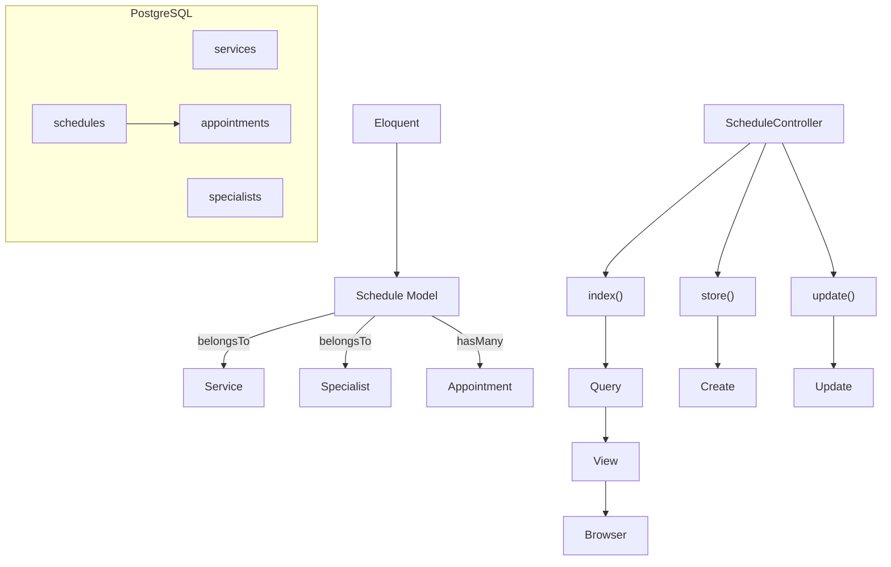

The important relationships:

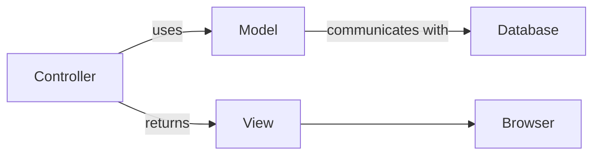

## 41. Quick Reference

| Concept | Code | Meaning |
|---|---|---|
| Model | `class Schedule extends Model` | Represents the `schedules` table |
| `$fillable` | `protected $fillable = [...]` | Defines fields allowed for mass assignment |
| `HasFactory` | `use HasFactory;` | Adds Laravel model factory functionality |
| `belongsTo` | `return $this->belongsTo(Service::class);` | This model belongs to another model |
| `hasMany` | `return $this->hasMany(Appointment::class);` | This model can have many related records |
| Controller | `class ScheduleController extends Controller` | Handles application actions/requests |
| Controller method | `public function index()` | A normal PHP method Laravel can call through routing |
| Request | `public function index(Request $request)` | Represents the incoming HTTP request |
| Validator | `Validator::make(...)` | Validates incoming data |
| namespace | `namespace App\Http\Controllers;` | Defines the PHP namespace of the class |
| use | `use App\Models\Schedule;` | Imports a class for convenient reference |
| `view()` | `return view('specialists.schedules.index');` | Returns a Blade view/HTML response |
| API response | `return response()->json($schedules);` | Returns JSON rather than a Blade view |

## 42. A Useful Debugging Checklist

<details>
<summary><strong>Database</strong></summary>

- Am I connected to the correct database?
- Does the table actually exist?
- Is the table in the expected schema?

For PostgreSQL:

```sql
SELECT current_database(), current_schema(), current_user;
```

</details>

<details>
<summary><strong>Model</strong></summary>

- Does the model exist?
- Is the namespace correct?
- Is the model pointing to the correct table?
- Are the relationships correct?

</details>

<details>
<summary><strong>Relationship</strong></summary>

Ask: **who owns the foreign key?**

- Does `Schedule` have `service_id`? → `Schedule belongsTo Service`
- Does `Appointment` have `schedule_id`? → `Schedule hasMany Appointments`

</details>

<details>
<summary><strong>Controller</strong></summary>

- Is the correct controller method being called?
- Is the request reaching the controller?
- Is validation passing?
- Is the query returning records?

</details>

<details>
<summary><strong>View</strong></summary>

- Is the correct Blade file being returned?
- Was the variable passed to the view?
- Does the Blade template use the correct variable name?

</details>

## 43. The Most Important Mental Rules

If you forget everything else, remember these:

- **MODEL** — "What data am I working with?"
- **CONTROLLER** — "What should happen when the user does something?"
- **VIEW** — "What should the user see?"
- **ROUTE** — "Which controller method should handle this request?"
- **ELOQUENT** — "How do I interact with the database using Laravel/PHP?"
- **RELATIONSHIP** — "How are my database records connected?"
- **`$fillable`** — "Which fields may be mass-assigned?"
- **Request** — "What did the client/browser send me?"
- **Validator** — "Is the incoming data valid?"
- **namespace** — "Which namespace does this PHP class belong to?"
- **use** — "Which classes do I want to reference conveniently?"

## 44. Final Mental Picture

When you see something like:

```php
public function store(Request $request)
{
    $validator = Validator::make(...);

    Schedule::create([
        'service_id' => $request->service_id,
        'specialist_id' => auth()->user()->user_id,
        'time_start' => $request->time_start,
        'time_end' => $request->time_end,
        'date' => $request->date,
    ]);

    return redirect(...);
}
```

don't see it as a giant block of Laravel magic. Read it as:

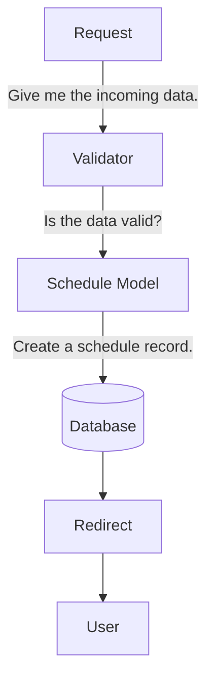

And when you see:

```php
public function service()
{
    return $this->belongsTo(Service::class);
}
```

read it as: **"This Schedule has a relationship with Service."**


:::tip Key takeaway
Once you start reading Laravel code this way, the framework becomes much less mysterious. You're no longer memorizing individual Laravel commands — you are understanding **PHP + HTTP + MVC + Eloquent + database relationships** working together.
:::