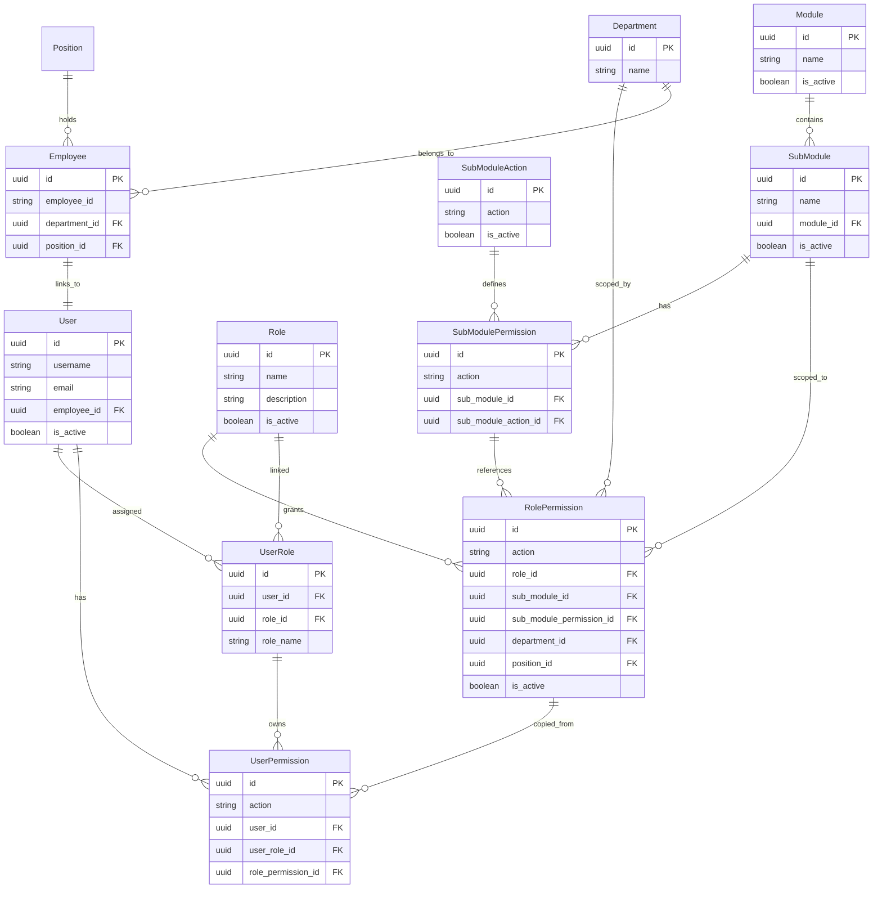
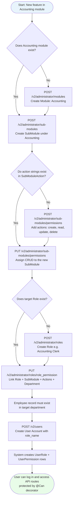
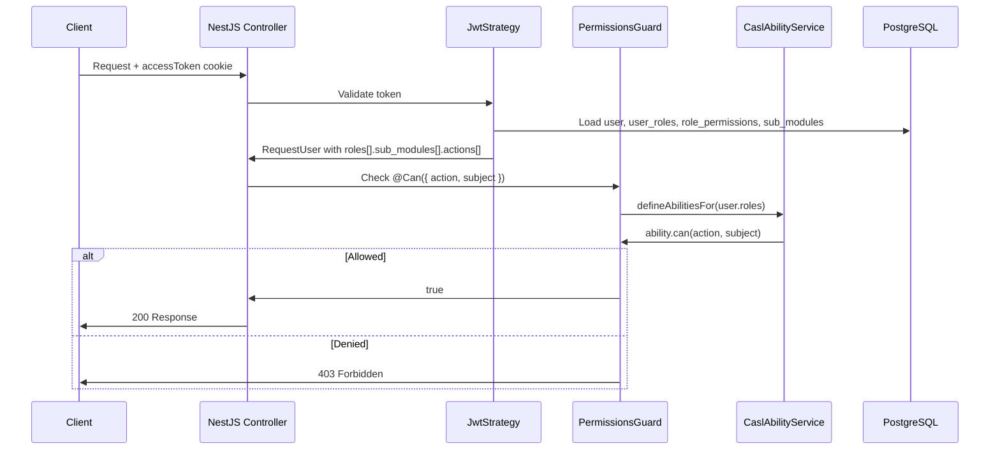

# User Management & Access Control — End-to-End Flow Guide

This document describes the full process in ABAS API V2 for:

1. Adding a **new submodule** under an existing module (e.g. **Accounting**)
2. Attaching **permissions** (create, read, update, delete) to that submodule
3. Defining a **role** with those permissions
4. **Creating a user account** that inherits the role and can access the feature

It is based on the current implementation in `prisma/schema.prisma`, administrator services, role services, and user management services.

---

## Table of Contents

1. [Concept Overview](#concept-overview)
2. [Entity Relationship Diagram (ERD)](#entity-relationship-diagram-erd)
3. [Data Model Layers](#data-model-layers)
4. [End-to-End Process Flow](#end-to-end-process-flow)
5. [Worked Example: Accounting Submodule](#worked-example-accounting-submodule)
6. [Runtime Authorization (How API Access Is Enforced)](#runtime-authorization-how-api-access-is-enforced)
7. [Prerequisites Checklist](#prerequisites-checklist)
8. [Common Pitfalls](#common-pitfalls)
9. [Related API Endpoints](#related-api-endpoints)

---

## Concept Overview

Access control in ABAS is built in layers. Each layer must exist before the next one works.

```
Module
  └── SubModule (feature / screen)
        └── SubModulePermission (which actions this feature supports)
              └── RolePermission (which role gets which actions, per department)
                    └── UserPermission (copied to user when account is created)
```

| Layer | Purpose | Example |
|-------|---------|---------|
| **Module** | Top-level application area | `Accounting` |
| **SubModule** | A screen or feature inside a module | `Accounts Payable` |
| **SubModuleAction** | Global catalog of possible actions | `create`, `read`, `update`, `delete` |
| **SubModulePermission** | Actions enabled for one submodule | `Accounts Payable` + `read` |
| **Role** | Named job function | `Accounting Clerk` |
| **RolePermission** | Role + submodule + action (+ department scope) | `Accounting Clerk` can `read` `Accounts Payable` in Accounting Dept |
| **User** | Login account linked to an employee | `jane.doe@company.com` |
| **UserRole** | Role assigned to a user | Jane → `Accounting Clerk` |
| **UserPermission** | User's effective permissions (snapshot from role) | Jane → `read` on `Accounts Payable` |

**Important:** Creating a submodule alone does **not** grant anyone access. You must also create **RolePermission** records and assign that role when creating the user account.

---

## Entity Relationship Diagram (ERD)



---

## Data Model Layers

### Layer 1 — Module & Submodule (Navigation Structure)

- **Module** groups related features (HR, Accounting, Administrator, etc.).
- **SubModule** is the unit used for authorization. API routes use the submodule **name** as the CASL `subject`.

The `Accounting` module is seeded in `prisma/seed.js`, but it currently has **no submodules**. New accounting features must be added explicitly.

### Layer 2 — Permission Inventory (What Actions Exist)

Two tables work together:

| Table | Role |
|-------|------|
| `SubModuleAction` | Master list of action strings (`create`, `read`, `update`, `delete`, …) |
| `SubModulePermission` | Links specific actions to a specific submodule |

When you assign permissions to a submodule, the system looks up actions in `SubModuleAction` and creates rows in `SubModulePermission`.

### Layer 3 — Role & Role Permissions (Who Can Do What)

- A **Role** is a reusable template (e.g. `Accounting Clerk`, `HR Manager`).
- **RolePermission** connects:
  - a **role**
  - a **submodule**
  - one or more **actions**
  - a **department** (required)
  - an optional **position**

Validation in `RoleService.createRolePermissions()` ensures every action you assign already exists in `SubModulePermission` for that submodule.

### Layer 4 — User Account (Assigning Access to a Person)

When a manager creates a user account (`UserManagementService.createUserAccount()`):

1. A `User` record is created and linked to an existing `Employee`.
2. If `role_name` is provided:
   - A `UserRole` row is created.
   - All active `RolePermission` rows for that role are copied into `UserPermission`.
3. A password reset token and session token are created.

The user does **not** get permissions directly from the submodule. They get them **through the role**.

---

## End-to-End Process Flow



### Phase 1 — Administrator: Structure the Module

**Who:** Administrator / Super Administrator  
**Guard:** `@Can({ action, subject: 'system management' })`

| Step | Action | API | Service |
|------|--------|-----|---------|
| 1 | Create module (if missing) | `POST /v2/administrator/modules` | `ModuleService.createModule()` |
| 2 | Create submodule | `POST /v2/administrator/sub-modules` | `SubModuleService.createSubModule()` |
| 3 | Register action strings (global inventory) | `POST /v2/administrator/sub-modules/permissions` | `SubModuleService.addSubModuleAction()` |
| 4 | Assign actions to submodule | `PUT /v2/administrator/sub-modules/permissions` | `SubModuleService.assignSubModulePermissions()` |

> **Note:** Step 3 is only needed if the action strings (e.g. `create`, `read`) are not already in `SubModuleAction`. The seed script pre-populates common actions.

### Phase 2 — Administrator: Configure the Role

| Step | Action | API | Service |
|------|--------|-----|---------|
| 5 | Create role (if missing) | `POST /v2/administrator/roles` | `RoleService.createRole()` |
| 6 | Assign submodule permissions to role | `PUT /v2/administrator/roles/role_permission` | `RoleService.createRolePermissions()` |

Each `RolePermission` row requires:

- `role_id`
- `sub_module_id`
- `action[]` — e.g. `["create", "read", "update", "delete"]`
- `department_id` — scopes permission to a department
- `position_id` (optional)

### Phase 3 — Manager: Create the User Account

**Who:** Administrator, Super Administrator, or Manager  
**Guard:** `@Can({ action: 'create', subject: 'user account' })` + security clearance level 5

| Step | Action | API | Service |
|------|--------|-----|---------|
| 7 | Create user linked to employee | `POST /v2/users` | `UserManagementService.createUserAccount()` |

**Request body (`UserDetailsDto`):**

```json
{
  "employee_id": "ABISC-250710-001",
  "username": "jane_accounting",
  "email": "jane.doe@company.com",
  "password": "temporaryPassword123",
  "role_name": "Accounting Clerk"
}
```

**What happens internally:**

```
Role (Accounting Clerk)
  → RolePermission rows (create/read/update/delete on Accounts Payable)
    → UserRole (user ↔ role)
      → UserPermission rows (one per RolePermission)
```

If the role has no `RolePermission` rows, user creation fails with:  
`"No permissions found for this role"`.

### Phase 4 — Developer: Protect the Feature API

When you build the Accounting feature controller, each route must declare the submodule subject:

```typescript
@Can({ action: ACTION_READ, subject: 'accounts payable' })
@Get('accounts-payable')
getAccountsPayable() { ... }
```

The `subject` must match the **SubModule name** (case-insensitive). Add a constant in `src/utils/constants/ability.constant.ts` for consistency.

---

## Worked Example: Accounting Submodule

Goal: Add **Accounts Payable** under **Accounting**, give an **Accounting Clerk** CRUD access, and create a user for a new accounting employee.

### Step 0 — Prerequisites

- Logged-in user with **System Management** permissions (Administrator).
- An employee in the accounting department (no user account yet).
- `Accounting` module already exists (seeded).

### Step 1 — Get the Accounting Module ID

```
GET /v2/administrator/modules?search=Accounting
```

Save `module.id` from the response.

### Step 2 — Create the Submodule

```
POST /v2/administrator/sub-modules
```

```json
{
  "name": "Accounts Payable",
  "module_id": "<accounting-module-uuid>"
}
```

Save `subModule_id` from the response.

### Step 3 — Assign CRUD Permissions to the Submodule

First confirm actions exist:

```
GET /v2/administrator/sub-modules/permissions
```

If `create`, `read`, `update`, `delete` are listed, proceed:

```
PUT /v2/administrator/sub-modules/permissions
```

```json
{
  "sub_module_id": "<accounts-payable-submodule-uuid>",
  "action": ["create", "read", "update", "delete"]
}
```

This creates rows in `SubModulePermission`.

### Step 4 — Create the Role (if it does not exist)

```
POST /v2/administrator/roles
```

```json
{
  "name": "Accounting Clerk",
  "description": "Handles accounts payable entries"
}
```

Save `role.id`.

### Step 5 — Assign Role Permissions

```
PUT /v2/administrator/roles/role_permission
```

```json
{
  "role_id": "<accounting-clerk-role-uuid>",
  "sub_module_id": "<accounts-payable-submodule-uuid>",
  "department_id": "<accounting-department-uuid>",
  "action": ["create", "read", "update", "delete"]
}
```

This creates four `RolePermission` rows (one per action).

### Step 6 — Create the User Account

```
POST /v2/users
```

```json
{
  "employee_id": "ABISC-250710-001",
  "username": "jane_accounting",
  "email": "jane.doe@company.com",
  "password": "ChangeMe123!",
  "role_name": "Accounting Clerk"
}
```

**Result in the database:**

| Table | Records created |
|-------|-----------------|
| `User` | 1 (linked to employee) |
| `UserRole` | 1 (`Accounting Clerk`) |
| `UserPermission` | 4 (create, read, update, delete on Accounts Payable) |
| `PasswordResetToken` | 1 |
| `UserToken` | 1 |

### Step 7 — Verify Access

After login, the JWT strategy loads:

```
User → UserRole → Role → RolePermission → SubModule
```

The user's JWT payload includes roles grouped as:

```json
{
  "roles": [
    {
      "name": "Accounting Clerk",
      "sub_modules": [
        {
          "name": "Accounts Payable",
          "actions": ["create", "read", "update", "delete"]
        }
      ]
    }
  ]
}
```

A route protected with `@Can({ action: 'read', subject: 'accounts payable' })` will succeed.

---

## Runtime Authorization (How API Access Is Enforced)



**Matching rules:**

1. `action` in `@Can()` is lowercased and must be in `VALID_ACTIONS`.
2. `subject` is the **submodule name** lowercased (e.g. `"Accounts Payable"` → `"accounts payable"`).
3. The user must have a `RolePermission` (via `UserPermission`) with that exact action on that submodule.

---

## Prerequisites Checklist

Before creating a user for a new submodule, confirm:

- [ ] Module exists (`Accounting`)
- [ ] SubModule created under that module
- [ ] `SubModulePermission` rows exist for required actions (create, read, update, delete)
- [ ] Role exists
- [ ] `RolePermission` rows link role + submodule + actions + department
- [ ] Employee exists in the correct department
- [ ] Creator has `create` on `user account` submodule
- [ ] Feature controller uses `@Can()` with matching submodule subject name
- [ ] Constant added to `ability.constant.ts` for the new submodule (recommended)

---

## Common Pitfalls

| Issue | Cause | Fix |
|-------|-------|-----|
| `"Invalid action(s) for this sub module"` when adding role permissions | Actions not assigned to submodule in `SubModulePermission` | Run Step 3 (`PUT sub-modules/permissions`) first |
| `"No permissions found for this role"` when creating user | Role has no `RolePermission` rows | Complete Step 5 |
| `403 You do not have permission to read accounts payable` | Submodule name mismatch in `@Can()` subject | Use exact submodule name (case-insensitive) |
| User created but cannot access admin routes | User role lacks `System Management` permissions | Expected — accounting users should not get admin access unless intended |
| Submodule created with no permissions | `createSubModule()` only creates the submodule record | Permissions must be assigned separately |
| Seed vs production behavior differs | Seed assigns all actions to all submodules automatically | In production, use explicit `assignSubModulePermissions()` |

---

## Related API Endpoints

All paths use API version **v2**.

### Administrator — Modules

| Method | Path | Description |
|--------|------|-------------|
| GET | `/administrator/modules` | List modules |
| GET | `/administrator/modules/:moduleId` | Module with submodules |
| POST | `/administrator/modules` | Create module |
| PUT | `/administrator/modules/:id` | Update module |

### Administrator — Submodules & Permissions

| Method | Path | Description |
|--------|------|-------------|
| GET | `/administrator/sub-modules` | List submodules |
| GET | `/administrator/sub-modules/:subModuleId` | Submodule detail |
| POST | `/administrator/sub-modules` | Create submodule |
| GET | `/administrator/sub-modules/permissions` | List global action inventory |
| POST | `/administrator/sub-modules/permissions` | Add new action strings to inventory |
| PUT | `/administrator/sub-modules/permissions` | Assign actions to a submodule |
| PUT | `/administrator/sub-module/permissions/:id` | Update an action in inventory |

### Administrator — Roles

| Method | Path | Description |
|--------|------|-------------|
| GET | `/administrator/roles` | List roles |
| GET | `/administrator/roles/:id` | Role with permissions |
| POST | `/administrator/roles` | Create role |
| PUT | `/administrator/roles/:roleId` | Update role |
| PUT | `/administrator/roles/role_permission` | Assign permissions to role |
| PUT | `/administrator/roles/role_permission/:id` | Update role permissions |

### User Management

| Method | Path | Description |
|--------|------|-------------|
| GET | `/users` | List user accounts |
| GET | `/users/new_employees` | Employees without accounts |
| GET | `/users/:userId` | User detail |
| POST | `/users` | Create user account (with optional `role_name`) |
| PUT | `/users/deactivate/:userId` | Deactivate account |
| PUT | `/users/reactivate/:userId` | Reactivate account |

---

## Alternative Path: Permission Templates

The codebase also supports **Permission Templates** (`PermissionTemplateService.assignTemplateToUser()`), which bundle role permissions by department. User account creation was refactored to use `role_name` directly, but templates remain available for bulk or standardized assignments.

For the standard flow described above, use **role_name** at user creation time.

---

## Source References

| Area | File |
|------|------|
| Database schema | `prisma/schema.prisma` |
| Seed data (modules, actions, permissions) | `prisma/seed.js` |
| Create submodule | `src/modules/administrator/sub_module/sub_module.service.ts` |
| Assign submodule permissions | `src/modules/administrator/sub_module/sub_module.service.ts` → `assignSubModulePermissions()` |
| Create role permissions | `src/modules/administrator/role/role.service.ts` → `createRolePermissions()` |
| Create user account | `src/modules/manager/user_management/user_management.service.ts` → `createUserAccount()` |
| JWT / role loading | `src/middleware/jwt/jwt.strategy.ts` |
| Permission guard (CASL) | `src/middleware/guards/permission.guard.ts` |
| Action / submodule constants | `src/utils/constants/ability.constant.ts` |

---

*Last updated: June 2026 — ABAS API V2*
