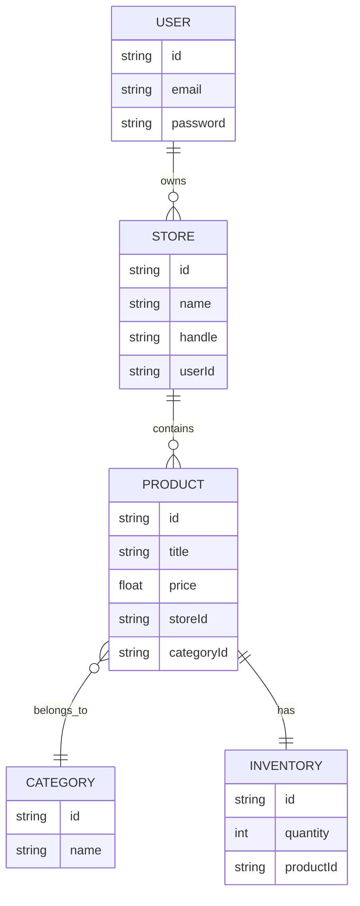
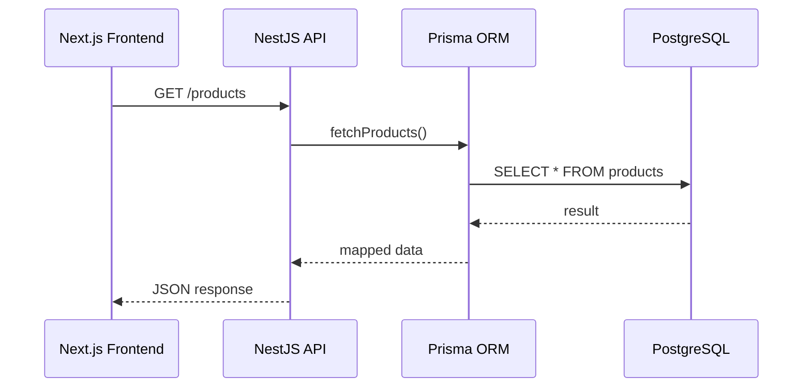
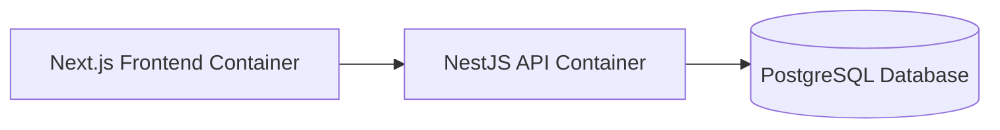
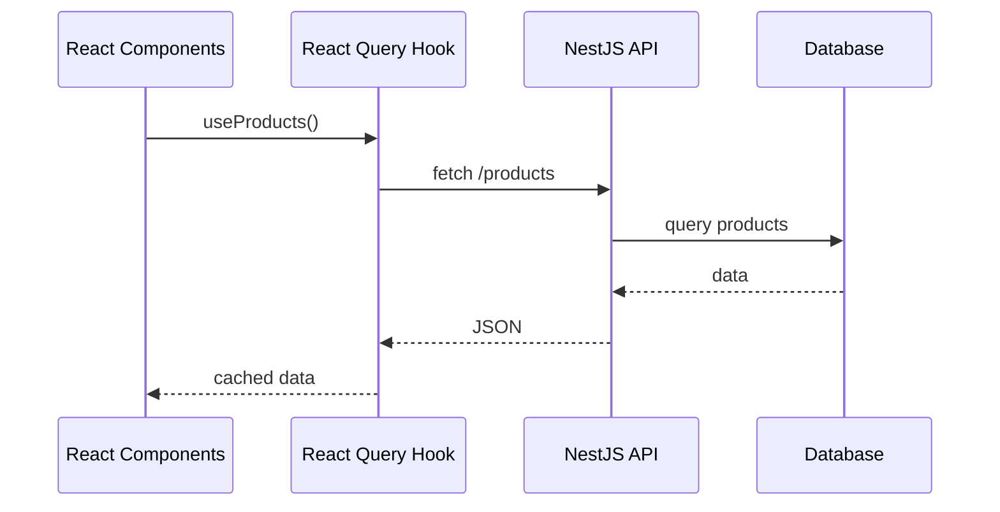
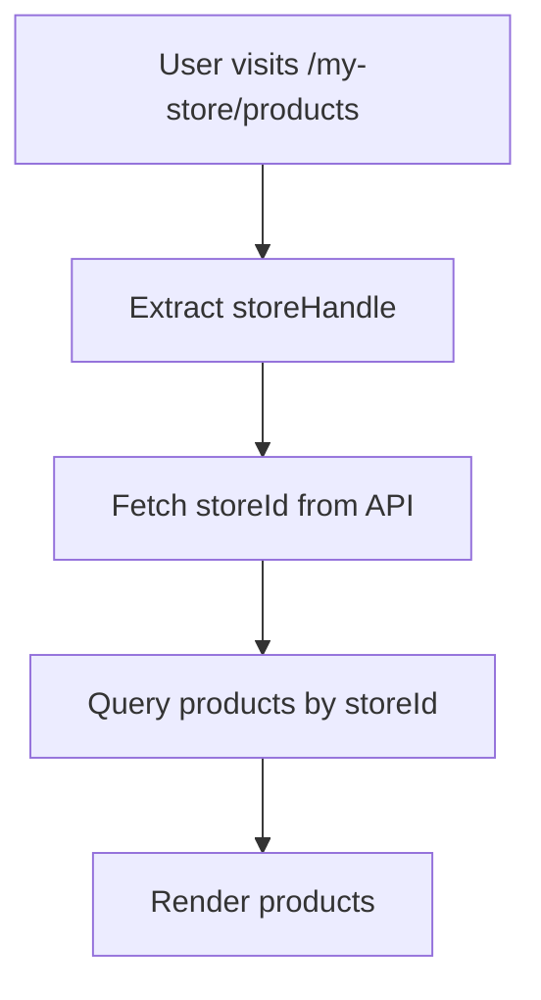
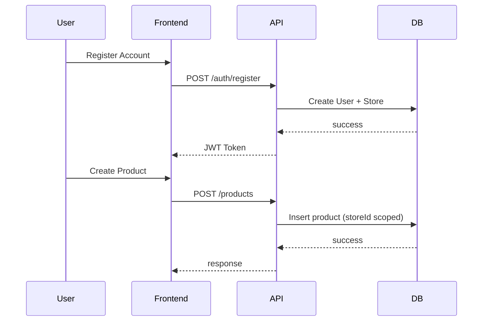
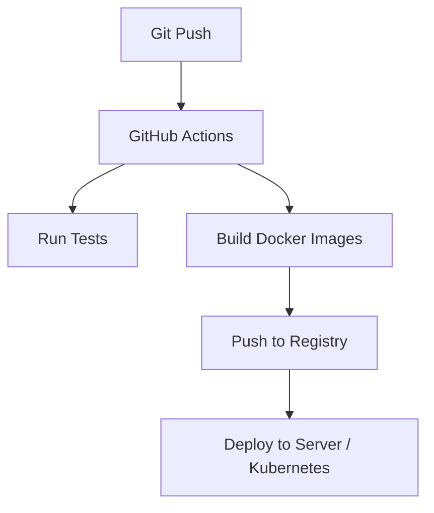
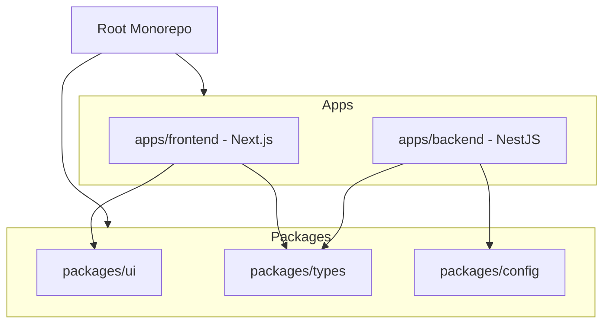
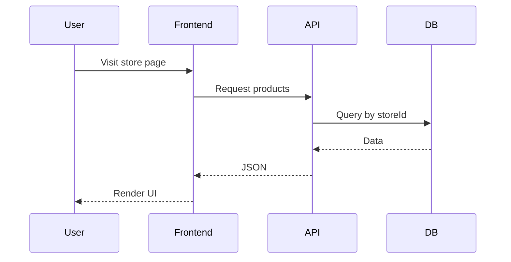

import Tabs from '@theme/Tabs';
import TabItem from '@theme/TabItem';

# 🧱 Marketplace Management and Inventory System — Architecture & Development Plan

## 📌 Overview

This project transitions a frontend built on a Shopify template into a fully custom, multi-tenant **Marketplace Management and Inventory System**, startup name will be ShopStack.

### 🎯 Goals

- Own the **data layer**
- Control **business logic**
- Enable **multi-store support**
- Build a **scalable DevOps-ready system**

---

# API STRUCTURE (FOR DOCS)

🔐 Auth Module
```bash
POST   /api/auth/register
POST   /api/auth/login
POST   /api/auth/logout
GET    /api/auth/me
POST   /api/auth/refresh
```

👤 User Module
```bash
GET    /api/users/me
PATCH  /api/users/me
DELETE /api/users/me
```bash

```bash
GET    /api/users/:id        (admin)
PATCH  /api/users/:id       (admin)
DELETE /api/users/:id       (admin)
```

🛠️ Admin Module
```bash
GET    /api/admin/dashboard

GET    /api/admin/users
GET    /api/admin/users/:id

GET    /api/admin/stores
GET    /api/admin/products

PATCH  /api/admin/products/:id   (approve/reject)
DELETE /api/admin/products/:id

GET    /api/admin/analytics/overview
GET    /api/admin/logs
```

🏪 Store Module (important)
```bash
POST   /api/stores
GET    /api/stores
GET    /api/stores/:id
PATCH  /api/stores/:id
DELETE /api/stores/:id

Store Members (optional but powerful)
GET    /api/stores/:id/members
POST   /api/stores/:id/members
PATCH  /api/stores/:id/members/:userId
DELETE /api/stores/:id/members/:userId
```

📦 Product Module (Scoped to Store)
```bash
POST   /api/stores/:storeId/products
GET    /api/stores/:storeId/products
GET    /api/products/:id
PATCH  /api/products/:id
DELETE /api/products/:id

GET    /api/products/reorder-recommendations
```

🗂️ Category Module
```bash
POST   /api/categories
GET    /api/categories
GET    /api/categories/:id
PATCH  /api/categories/:id
DELETE /api/categories/:id
```

📊 Inventory Module (NEW)
```bash
GET    /api/stores/:storeId/inventory
PATCH  /api/stores/:storeId/inventory/:productId

POST   /api/inventory/adjust
GET    /api/inventory/history
```

🛒 Cart Module (FIXED STRUCTURE)
```bash
GET    /api/cart
POST   /api/cart
PATCH  /api/cart/:itemId
DELETE /api/cart/:itemId

👉 Remove:
PATCH /api/orders
DELETE /api/orders
POST  /api/orders/cart
```

🧾 Order Module
```bash
POST   /api/orders/checkout
GET    /api/orders
GET    /api/orders/:id
GET    /api/orders/my

PATCH  /api/orders/:id/status

GET    /api/orders/product/:productId/history
GET    /api/orders/sales-trends
```

🧾 Invoice Module
```bash
GET    /api/invoice/:orderId
📊 Analytics Module (FIX PATH)
GET    /api/analytics/admin-inventory
GET    /api/analytics/top-products
GET    /api/analytics/sales
```

🌐 Public Storefront (NEW 🔥)
```bash
GET /api/public/stores
GET /api/public/stores/:id

GET /api/public/products
GET /api/public/products/:id
```

⭐ Optional (Advanced Features)
```bash
POST /api/products/:id/reviews
GET  /api/products/:id/reviews

GET  /api/search/products?q=shoes
```

🧱 FINAL CLEANUP NOTES
```bash
🚨 Rename / Fix
❌ /api/api/analytics/... → /api/analytics/...
❌ cart inside orders → separate module
❌ /api/dashboard → /api/admin/dashboard
```

---

# 🗺️ Development Phases

---

## Phase 1 — 👷‍♂️ Infrastructure & Backend Core

### 🎯 Goal
Establish backend as the **source of truth**

---

### 🧩 Database Schema (Prisma)



---

### 🔄 Sequence Flow



---

### 🧱 Architecture Flow



---

## Phase 2 — ⛓️‍💥 Frontend Decoupling

### 🎯 Goal
Replace Shopify dependencies with internal API

### 🔄 Data Fetching Flow



---

### 🔧 Key Changes

- Replace use-shopify → **custom hooks**
- Use React Query
- Replace environment variable:

```bash
NEXT_PUBLIC_API_URL=http://localhost:3000
```

## Phase 3 — 🤝 Multi-Tenancy & Store System

### 🎯 Goal

Support **multiple** independent stores

---

### 🧩 Store Routing



---

### 🔄 Auth + Store Flow



---

## Phase 4 — 👨‍💻 DevOps & Scalability



---

### 🧩 Migration Strategy in the future

- Abstract service layer
- Replace ORM without breaking API:
  - Prisma → Drizzle / Supabase

---

### 🧱 Monorepo Architecture (Turborepo)



---

## 📁 Suggested Structure

```bash
apps/
  frontend/   # Next.js app
  backend/    # NestJS API

packages/
  ui/         # shared components
  types/      # shared types/interfaces
  config/     # eslint, tsconfig, etc.
```

---

## 🔁 System-Wide Data Flow



---

## 🆚 Shopify vs Custom System

| Feature         | Shopify Template     | Custom System   |
|-----------------|----------------------|-----------------|
| Database        | Shopify-managed      | SQL (Prisma)    |
| API             | Shopify GraphQL      | NestJS API      |
| Control         | Limited              | Full            |
| Auth            | External             | Internal        |
| Multi-tenancy   | Built-in             | Custom          |

---

## 🧠 Design Principles
- Decoupled Architecture
- Interface Stability
- Scalability-first mindset
- ORM abstraction

---

## 🚀 Future Enhancements
- Role-based access control
- Order management system
- Analytics dashboard
- Redis caching
- Event-driven architecture (webhooks)
### 🛍️ Missing marketplace-level features (future)
Not required now, but needed in future:
- Order per store split (important for multi-vendor)
- Payment table
- Shipping info

---
