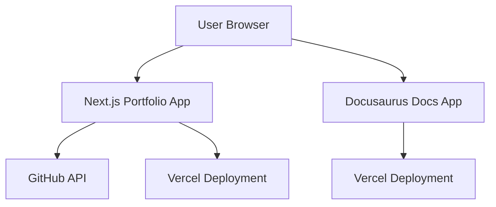
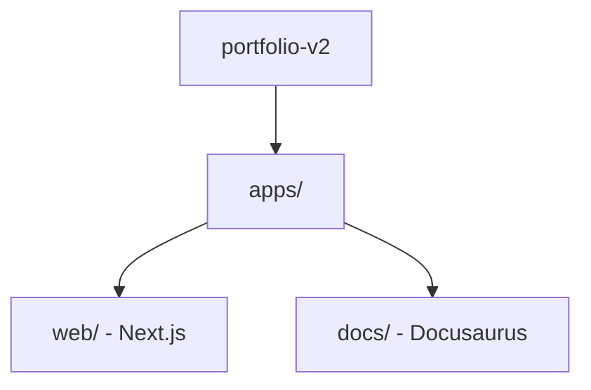
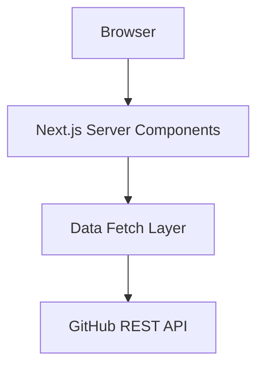

# System Architecture

This project follows a monorepo architecture containing two independently deployed applications:

- Portfolio Web Application (Next.js)
- Documentation Platform (Docusaurus)

Both applications share a single Git repository but are deployed separately.

---

## High-Level Architecture

---

## Monorepo Structure

Why Monorepo?

- Single source of truth
- Centralized version control
- Independent deployments
- Easier long-term scaling
- Clear separation of concerns

---

## Web Application Architecture

The portfolio application uses:

- App Router
- Server Components
- API integration layer
- Typed data contracts

Data Flow

1. Server component fetches repositories.
2. Data is filtered and transformed.
3. Project cards render on the client.
4. Sensitive tokens remain server-side.

---

## Deployment Pipeline

flowchart LR
    Dev[Developer Push] --> GitHubRepo[GitHub Repository]
    GitHubRepo --> VercelCI[Vercel CI/CD]
    VercelCI --> Production[Production Deployment]

CI/CD Principles

- Automatic build on every push
- Environment variable isolation
- Separate production builds per app
- Zero-downtime deployments

---

## Design Principles

- Separation of concerns
- Secure API handling
- Scalable folder structure
- Typed contracts
- Infrastructure as configuration
- Documentation-first mindset