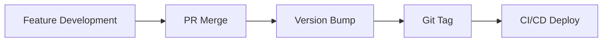

# 🏷️ Semantic Versioning Strategy (Per Phase)

### 🎯 Goal
Track system evolution with clear, meaningful releases

### 📦 Versioning Format

```bash
MAJOR.MINOR.PATCH
```

---

### 🧩 Phase-Based Version Mapping

| Phase        | Description              | Version       |
|--------------|--------------------------|---------------|
| Phase 1      | Backend + DB foundation  | v1.0.0        |
| Phase 2      | Shopify GraphQL          | v1.1.0        |
| Phase 3      | Limited                  | v1.2.0        |
| Phase 4      | External                 | v1.3.0        |

---

### 🔄 Release Flow



---

### 📌 Versioning Rules

#### MAJOR (v2.0.0)
- Breaking API changes
- Schema redesign
- Auth system overhaul

#### MINOR (v1.1.0)
- New features (non-breaking)
- New endpoints
- UI enhancements

#### PATCH (v1.0.1)
- Bug fixes
- Performance improvements
- Minor internal changes

---

### 🧩 Example Roadmap

| Version    | Changes               | 
|------------|-----------------------|
| v1.0.0     | Initial backend + DB  | 
| v1.1.0     | Replace Shopify API   | 
| v1.2.0     | Multi-store + auth    |
| v1.3.0	 | CI/CD + infra         |
| v1.4.0     | Admin dashboard       |

---

### 🚀 Tagging Convention
```bash
git tag v1.2.0
git push origin v1.2.0
```

---

✅ Best Practices
- Automate versioning via CI
- Use conventional commits:
  - feat:
  - fix:
  - chore:
- Generate changelogs automatically